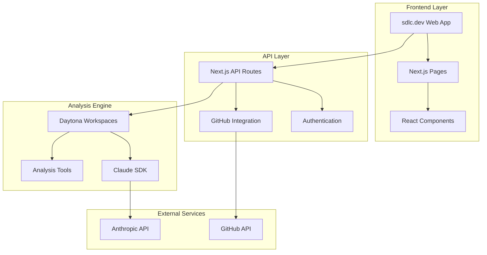

# sdlc.dev Documentation

This directory contains comprehensive documentation for the sdlc.dev AI-powered development platform.

## 📚 Documentation Structure

### Core Documentation

- **[GitHub Digest Implementation Plan](./github-digest-implementation-plan.md)** - Complete technical implementation plan for the GitHub repository analysis and digest feature
- **[Daytona Integration Guide](./daytona-integration-guide.md)** - Detailed guide for integrating Daytona workspaces with Claude SDK and analysis tools

## 🎯 Project Overview

**sdlc.dev** is an AI-powered development platform that provides:

1. **Text-to-Code Generation** - Transform ideas into production-ready code using Claude AI
2. **GitHub Repository Analysis** - Comprehensive repository analysis and digest reports
3. **Onboarding Guide Generation** - AI-powered onboarding guides for repositories
4. **Code Quality Assessment** - Static analysis and quality metrics
5. **Security Vulnerability Scanning** - Automated security analysis and recommendations

## 🏗️ Architecture Overview



## 🚀 Key Features

### Current Features
- ✅ **Clean, Minimal UI** - Claude-inspired interface with light theme
- ✅ **sdlc.dev Branding** - Professional branding and consistent design
- ✅ **Text-to-Code Generation** - AI-powered code generation using Claude SDK
- ✅ **Daytona Integration** - Isolated sandbox environments for code generation

### Planned Features
- 🔄 **GitHub OAuth Integration** - Connect and authenticate with GitHub repositories
- 🔄 **Repository Analysis** - Comprehensive static analysis using multiple tools
- 🔄 **Digest Reports** - AI-generated repository summaries and insights
- 🔄 **Onboarding Guides** - Automated onboarding documentation generation
- 🔄 **Quality Metrics** - Code quality scoring and recommendations
- 🔄 **Security Scanning** - Vulnerability detection and security recommendations

## 🛠️ Technology Stack

### Frontend
- **Next.js 14** - React framework with App Router
- **TypeScript** - Type-safe JavaScript
- **Tailwind CSS** - Utility-first CSS framework
- **React Components** - Modular, reusable UI components

### Backend
- **Next.js API Routes** - Serverless API endpoints
- **Claude SDK** - AI-powered code analysis and generation
- **Daytona SDK** - Workspace management and isolation
- **GitHub API** - Repository access and management

### Analysis Tools
- **ESLint/TSLint** - Code quality and style checking
- **npm audit** - Security vulnerability scanning
- **SonarJS** - Code quality and complexity analysis
- **dependency-check** - Dependency vulnerability analysis

### Infrastructure
- **Daytona Workspaces** - Isolated analysis environments
- **GitHub OAuth** - Secure repository access
- **Anthropic API** - Claude AI model access

## 📋 Implementation Phases

### Phase 1: Foundation (Weeks 1-2)
- [x] Project setup and branding
- [x] Clean UI implementation
- [x] Basic Claude SDK integration
- [ ] GitHub OAuth implementation
- [ ] Daytona workspace management

### Phase 2: Analysis Engine (Weeks 3-4)
- [ ] Repository cloning and setup
- [ ] Static analysis tools integration
- [ ] Security scanning implementation
- [ ] Quality metrics calculation

### Phase 3: Digest Generation (Weeks 5-6)
- [ ] AI-powered analysis with Claude SDK
- [ ] Report generation and formatting
- [ ] UI components for digest display
- [ ] Export functionality

### Phase 4: Enhancement (Weeks 7-8)
- [ ] Real-time updates via webhooks
- [ ] Historical tracking and trends
- [ ] Performance optimization
- [ ] Comprehensive testing

## 🎨 Design System

### Color Palette
- **Primary**: Orange (#F97316) - Used for accents, buttons, and highlights
- **Background**: Light Gray (#F9FAFB) - Main background color
- **Surface**: White (#FFFFFF) - Card and component backgrounds
- **Text**: Gray scale (#111827 to #6B7280) - Various text hierarchies
- **Borders**: Light Gray (#E5E7EB) - Subtle borders and dividers

### Typography
- **Font Family**: Inter - Clean, modern sans-serif
- **Hierarchy**: Clear text size and weight hierarchy
- **Spacing**: Consistent line heights and spacing

### Components
- **Minimal Design** - Clean, uncluttered interfaces
- **Consistent Patterns** - Reusable component patterns
- **Accessibility** - WCAG compliant design
- **Responsive** - Mobile-first responsive design

## 🔧 Development Guidelines

### Code Standards
- **TypeScript** - Strict typing throughout the codebase
- **ESLint** - Code quality and consistency enforcement
- **Prettier** - Code formatting standardization
- **Component Structure** - Modular, reusable components

### Documentation Standards
- **JSDoc Comments** - Comprehensive function and class documentation
- **README Files** - Clear setup and usage instructions
- **API Documentation** - OpenAPI specifications for all endpoints
- **Architecture Diagrams** - Mermaid diagrams for system visualization

### Testing Strategy
- **Unit Tests** - Jest for component and function testing
- **Integration Tests** - End-to-end workflow testing
- **API Tests** - Comprehensive API endpoint testing
- **Performance Tests** - Load and performance testing

## 🚀 Getting Started

### Prerequisites
- Node.js 18+ and npm
- GitHub account for repository access
- Anthropic API key for Claude SDK
- Daytona account for workspace management

### Installation
```bash
# Clone the repository
git clone https://github.com/durdan/sdlc-tools.git
cd sdlc-tools

# Install dependencies
cd sdlc-tools
npm install

# Set up environment variables
cp .env.example .env.local
# Add your API keys to .env.local

# Start development server
npm run dev
```

### Environment Variables
```env
ANTHROPIC_API_KEY=your_anthropic_api_key
DAYTONA_API_KEY=your_daytona_api_key
GITHUB_CLIENT_ID=your_github_client_id
GITHUB_CLIENT_SECRET=your_github_client_secret
```

## 📖 API Documentation

### Core Endpoints
- `POST /api/generate` - Generate code from text prompts
- `POST /api/github/auth` - GitHub OAuth authentication
- `GET /api/github/repos` - List user repositories
- `POST /api/analyze/repo` - Analyze repository and generate digest

### Response Formats
All API responses follow a consistent JSON structure with proper error handling and status codes.

## 🔒 Security Considerations

### Data Protection
- Repository code processed only in isolated Daytona workspaces
- No persistent storage of repository content
- Secure token management for GitHub and API access
- Encrypted communication between all services

### Access Control
- OAuth-based GitHub authentication
- Scoped permissions for repository access
- Rate limiting for API endpoints
- Audit logging for security events

## 📈 Performance Metrics

### Target Metrics
- **Analysis Time**: < 5 minutes per repository
- **System Uptime**: > 99.9%
- **Error Rate**: < 1%
- **Response Time**: < 2 seconds for UI interactions

### Monitoring
- Real-time performance monitoring
- Error tracking and alerting
- Usage analytics and insights
- Resource utilization tracking

## 🤝 Contributing

### Development Workflow
1. Fork the repository
2. Create a feature branch
3. Implement changes with tests
4. Submit a pull request
5. Code review and approval
6. Merge to main branch

### Code Review Guidelines
- Ensure TypeScript compliance
- Verify test coverage
- Check documentation updates
- Validate security considerations
- Confirm UI/UX consistency

## 📞 Support

For questions, issues, or contributions:
- **GitHub Issues**: [Report bugs or request features](https://github.com/durdan/sdlc-tools/issues)
- **Documentation**: Refer to the guides in this directory
- **Community**: Join discussions in GitHub Discussions

---

## 📄 License

This project is open source. See the LICENSE file for details.

## 🙏 Acknowledgments

- **Anthropic** - For the powerful Claude AI models
- **Daytona** - For isolated development environments
- **GitHub** - For repository hosting and API access
- **Next.js Team** - For the excellent React framework
