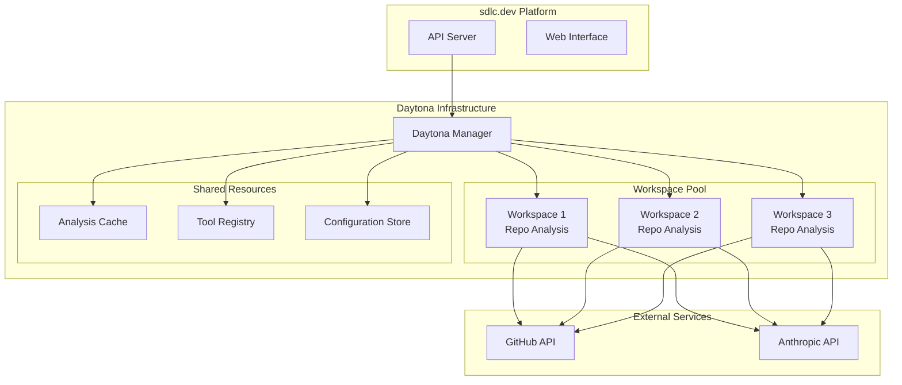
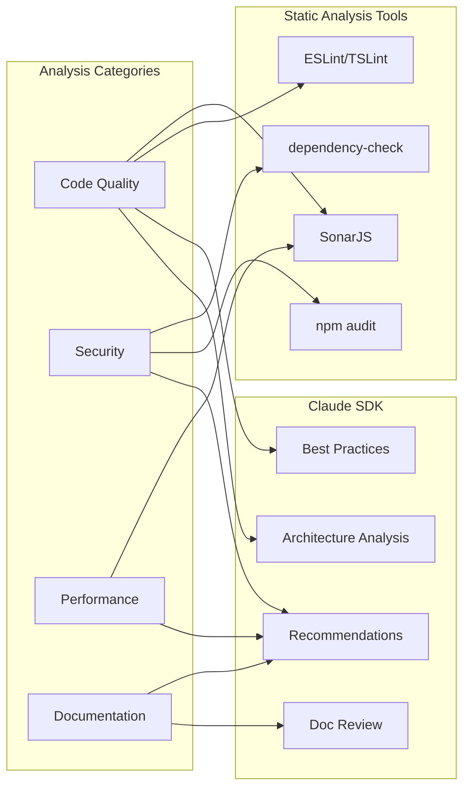

# Daytona Integration Guide for sdlc.dev

## 🎯 Overview

This guide details how to effectively integrate Daytona with Claude SDK and other analysis tools for the GitHub digest feature in sdlc.dev.

## 🏗️ Daytona Architecture for Repository Analysis

### Why Daytona?

1. **Isolation**: Each repository analysis runs in a clean, isolated environment
2. **Scalability**: Handle multiple concurrent analyses without resource conflicts
3. **Security**: Repository code never touches the main application server
4. **Tool Management**: Easy installation and version management of analysis tools
5. **Resource Optimization**: Automatic cleanup and efficient resource usage

### Daytona Workspace Configuration



## 🔧 Workspace Setup and Configuration

### Base Workspace Configuration

```yaml
# .daytona/workspace-templates/repo-analysis.yaml
name: repo-analysis-template
description: Template for GitHub repository analysis
image: node:18-alpine

# Pre-installed tools and dependencies
tools:
  - name: claude-sdk
    version: latest
    install: npm install -g @anthropic-ai/claude-code
  
  - name: eslint
    version: latest
    install: npm install -g eslint @typescript-eslint/parser @typescript-eslint/eslint-plugin
  
  - name: sonarjs
    version: latest
    install: npm install -g sonarjs-cli
  
  - name: audit-tools
    version: latest
    install: npm install -g audit-ci npm-audit-html
  
  - name: dependency-check
    version: latest
    install: |
      wget https://github.com/jeremylong/DependencyCheck/releases/download/v8.4.0/dependency-check-8.4.0-release.zip
      unzip dependency-check-8.4.0-release.zip
      mv dependency-check /usr/local/bin/

# Environment variables
environment:
  NODE_ENV: analysis
  ANALYSIS_MODE: comprehensive
  LOG_LEVEL: info

# Resource limits
resources:
  cpu: 2
  memory: 4Gi
  storage: 10Gi

# Lifecycle scripts
scripts:
  setup: |
    echo "Setting up analysis environment..."
    npm cache clean --force
    mkdir -p /workspace/analysis-results
    mkdir -p /workspace/temp
    
  pre-analysis: |
    echo "Preparing repository for analysis..."
    cd /workspace/repo
    if [ -f package.json ]; then
      npm install --production=false
    fi
    
  post-analysis: |
    echo "Cleaning up analysis artifacts..."
    rm -rf node_modules/.cache
    rm -rf /workspace/temp/*
    
  cleanup: |
    echo "Final cleanup..."
    rm -rf /workspace/repo
    rm -rf /workspace/analysis-results
```

### Dynamic Workspace Creation

```typescript
// lib/daytona/workspace-manager.ts
import { DaytonaClient } from '@daytonaio/sdk'

export class WorkspaceManager {
  private client: DaytonaClient
  
  constructor() {
    this.client = new DaytonaClient({
      apiKey: process.env.DAYTONA_API_KEY!,
      baseUrl: process.env.DAYTONA_BASE_URL!
    })
  }
  
  async createAnalysisWorkspace(repoUrl: string, analysisType: 'full' | 'quick' = 'full'): Promise<string> {
    const workspaceConfig = {
      name: `analysis-${Date.now()}`,
      template: 'repo-analysis-template',
      environment: {
        REPO_URL: repoUrl,
        ANALYSIS_TYPE: analysisType,
        ANTHROPIC_API_KEY: process.env.ANTHROPIC_API_KEY!
      },
      resources: analysisType === 'full' ? {
        cpu: 2,
        memory: '4Gi'
      } : {
        cpu: 1,
        memory: '2Gi'
      }
    }
    
    const workspace = await this.client.createWorkspace(workspaceConfig)
    return workspace.id
  }
  
  async executeAnalysis(workspaceId: string, analysisScript: string): Promise<AnalysisResult> {
    const result = await this.client.executeCommand(workspaceId, {
      command: analysisScript,
      workingDirectory: '/workspace',
      timeout: 600000 // 10 minutes
    })
    
    return this.parseAnalysisResult(result.output)
  }
  
  async destroyWorkspace(workspaceId: string): Promise<void> {
    await this.client.deleteWorkspace(workspaceId)
  }
  
  private parseAnalysisResult(output: string): AnalysisResult {
    // Parse the analysis output and return structured results
    return JSON.parse(output)
  }
}
```

## 🤖 Claude SDK Integration in Daytona

### Claude SDK Setup Script

```bash
#!/bin/bash
# scripts/setup-claude-analysis.sh

echo "Setting up Claude SDK for repository analysis..."

# Install Claude SDK
npm install -g @anthropic-ai/claude-code

# Create analysis script
cat > /workspace/claude-analysis.js << 'EOF'
const { query } = require('@anthropic-ai/claude-code');

async function analyzeRepository() {
  const analysisPrompt = `
    Please analyze this repository and provide:
    1. Architecture overview and patterns used
    2. Code quality assessment
    3. Documentation quality review
    4. Security considerations
    5. Performance optimization opportunities
    6. Onboarding guide for new developers
    7. Recommended improvements and next steps
    
    Focus on providing actionable insights and specific recommendations.
  `;
  
  const results = [];
  
  for await (const message of query({
    prompt: analysisPrompt,
    options: {
      maxTurns: 5,
      allowedTools: ['Read', 'Glob', 'Grep', 'LS']
    }
  })) {
    results.push(message);
  }
  
  return results;
}

analyzeRepository()
  .then(results => {
    console.log(JSON.stringify({
      type: 'claude-analysis',
      timestamp: new Date().toISOString(),
      results: results
    }, null, 2));
  })
  .catch(error => {
    console.error(JSON.stringify({
      type: 'error',
      message: error.message,
      stack: error.stack
    }, null, 2));
  });
EOF

chmod +x /workspace/claude-analysis.js
echo "Claude SDK setup complete!"
```

### Comprehensive Analysis Pipeline

```typescript
// lib/daytona/analysis-pipeline.ts
export class AnalysisPipeline {
  constructor(private workspaceManager: WorkspaceManager) {}
  
  async runComprehensiveAnalysis(repoUrl: string): Promise<ComprehensiveReport> {
    const workspaceId = await this.workspaceManager.createAnalysisWorkspace(repoUrl, 'full')
    
    try {
      // Step 1: Clone repository
      await this.cloneRepository(workspaceId, repoUrl)
      
      // Step 2: Run parallel analyses
      const [
        claudeResults,
        eslintResults,
        securityResults,
        dependencyResults,
        qualityResults
      ] = await Promise.all([
        this.runClaudeAnalysis(workspaceId),
        this.runESLintAnalysis(workspaceId),
        this.runSecurityAnalysis(workspaceId),
        this.runDependencyAnalysis(workspaceId),
        this.runQualityAnalysis(workspaceId)
      ])
      
      // Step 3: Generate comprehensive report
      return this.generateReport({
        claude: claudeResults,
        eslint: eslintResults,
        security: securityResults,
        dependencies: dependencyResults,
        quality: qualityResults
      })
      
    } finally {
      // Always cleanup workspace
      await this.workspaceManager.destroyWorkspace(workspaceId)
    }
  }
  
  private async cloneRepository(workspaceId: string, repoUrl: string): Promise<void> {
    const cloneScript = `
      cd /workspace
      git clone ${repoUrl} repo
      cd repo
      echo "Repository cloned successfully"
    `
    
    await this.workspaceManager.executeAnalysis(workspaceId, cloneScript)
  }
  
  private async runClaudeAnalysis(workspaceId: string): Promise<ClaudeAnalysisResult> {
    const claudeScript = `
      cd /workspace/repo
      export ANTHROPIC_API_KEY="${process.env.ANTHROPIC_API_KEY}"
      node /workspace/claude-analysis.js
    `
    
    const result = await this.workspaceManager.executeAnalysis(workspaceId, claudeScript)
    return result as ClaudeAnalysisResult
  }
  
  private async runESLintAnalysis(workspaceId: string): Promise<ESLintResult> {
    const eslintScript = `
      cd /workspace/repo
      
      # Create ESLint config if not exists
      if [ ! -f .eslintrc.js ] && [ ! -f .eslintrc.json ]; then
        cat > .eslintrc.js << 'ESLINT_EOF'
module.exports = {
  env: {
    browser: true,
    es2021: true,
    node: true
  },
  extends: [
    'eslint:recommended',
    '@typescript-eslint/recommended'
  ],
  parser: '@typescript-eslint/parser',
  parserOptions: {
    ecmaVersion: 12,
    sourceType: 'module'
  },
  rules: {
    'no-unused-vars': 'warn',
    'no-console': 'warn',
    'prefer-const': 'error'
  }
};
ESLINT_EOF
      fi
      
      # Run ESLint
      eslint . --format json --output-file /workspace/analysis-results/eslint-report.json || true
      cat /workspace/analysis-results/eslint-report.json
    `
    
    const result = await this.workspaceManager.executeAnalysis(workspaceId, eslintScript)
    return JSON.parse(result.output)
  }
  
  private async runSecurityAnalysis(workspaceId: string): Promise<SecurityResult> {
    const securityScript = `
      cd /workspace/repo
      
      # Run npm audit if package.json exists
      if [ -f package.json ]; then
        npm audit --json > /workspace/analysis-results/npm-audit.json 2>/dev/null || true
      fi
      
      # Run dependency check
      dependency-check --project "Repository Analysis" --scan . --format JSON --out /workspace/analysis-results/dependency-check.json || true
      
      # Combine results
      echo '{"npm_audit":' > /workspace/analysis-results/security-report.json
      cat /workspace/analysis-results/npm-audit.json >> /workspace/analysis-results/security-report.json 2>/dev/null || echo 'null' >> /workspace/analysis-results/security-report.json
      echo ',"dependency_check":' >> /workspace/analysis-results/security-report.json
      cat /workspace/analysis-results/dependency-check.json >> /workspace/analysis-results/security-report.json 2>/dev/null || echo 'null' >> /workspace/analysis-results/security-report.json
      echo '}' >> /workspace/analysis-results/security-report.json
      
      cat /workspace/analysis-results/security-report.json
    `
    
    const result = await this.workspaceManager.executeAnalysis(workspaceId, securityScript)
    return JSON.parse(result.output)
  }
}
```

## 📊 Analysis Tool Integration

### Tool Configuration Matrix



### Tool Integration Scripts

```bash
# scripts/analysis-tools-setup.sh
#!/bin/bash

echo "Installing analysis tools in Daytona workspace..."

# ESLint and TypeScript support
npm install -g eslint
npm install -g @typescript-eslint/parser
npm install -g @typescript-eslint/eslint-plugin

# Security tools
npm install -g audit-ci
npm install -g npm-audit-html

# Code quality tools
npm install -g sonarjs-cli
npm install -g jscpd  # Copy-paste detector

# Dependency analysis
wget -O /tmp/dependency-check.zip https://github.com/jeremylong/DependencyCheck/releases/download/v8.4.0/dependency-check-8.4.0-release.zip
unzip /tmp/dependency-check.zip -d /usr/local/
ln -s /usr/local/dependency-check/bin/dependency-check.sh /usr/local/bin/dependency-check

# Performance analysis tools
npm install -g clinic
npm install -g autocannon

echo "All analysis tools installed successfully!"
```

## 🔄 Workflow Integration

### API Integration with Daytona

```typescript
// app/api/analyze/repo/route.ts
import { NextRequest, NextResponse } from 'next/server'
import { AnalysisPipeline } from '@/lib/daytona/analysis-pipeline'
import { WorkspaceManager } from '@/lib/daytona/workspace-manager'

export async function POST(request: NextRequest) {
  try {
    const { repoUrl, analysisType = 'full' } = await request.json()
    
    const workspaceManager = new WorkspaceManager()
    const pipeline = new AnalysisPipeline(workspaceManager)
    
    // Stream analysis progress to client
    const stream = new ReadableStream({
      async start(controller) {
        try {
          const report = await pipeline.runComprehensiveAnalysis(repoUrl)
          
          controller.enqueue(new TextEncoder().encode(
            `data: ${JSON.stringify({ type: 'complete', report })}\n\n`
          ))
          
          controller.close()
        } catch (error) {
          controller.enqueue(new TextEncoder().encode(
            `data: ${JSON.stringify({ type: 'error', message: error.message })}\n\n`
          ))
          controller.close()
        }
      }
    })
    
    return new NextResponse(stream, {
      headers: {
        'Content-Type': 'text/event-stream',
        'Cache-Control': 'no-cache',
        'Connection': 'keep-alive'
      }
    })
    
  } catch (error) {
    return NextResponse.json(
      { error: 'Analysis failed', message: error.message },
      { status: 500 }
    )
  }
}
```

## 🚀 Performance Optimization

### Workspace Pool Management

```typescript
// lib/daytona/workspace-pool.ts
export class WorkspacePool {
  private availableWorkspaces: Set<string> = new Set()
  private busyWorkspaces: Set<string> = new Set()
  private maxPoolSize = 5
  
  async getWorkspace(): Promise<string> {
    if (this.availableWorkspaces.size > 0) {
      const workspaceId = this.availableWorkspaces.values().next().value
      this.availableWorkspaces.delete(workspaceId)
      this.busyWorkspaces.add(workspaceId)
      return workspaceId
    }
    
    if (this.getTotalWorkspaces() < this.maxPoolSize) {
      return await this.createNewWorkspace()
    }
    
    // Wait for available workspace
    return await this.waitForAvailableWorkspace()
  }
  
  async releaseWorkspace(workspaceId: string): Promise<void> {
    this.busyWorkspaces.delete(workspaceId)
    
    // Clean workspace for reuse
    await this.cleanWorkspace(workspaceId)
    this.availableWorkspaces.add(workspaceId)
  }
  
  private getTotalWorkspaces(): number {
    return this.availableWorkspaces.size + this.busyWorkspaces.size
  }
}
```

## 📈 Monitoring and Observability

### Analysis Metrics Collection

```typescript
// lib/daytona/metrics.ts
export class AnalysisMetrics {
  async recordAnalysisStart(repoUrl: string, workspaceId: string): Promise<void> {
    // Record analysis start time and metadata
  }
  
  async recordAnalysisComplete(
    workspaceId: string, 
    duration: number, 
    results: AnalysisResult
  ): Promise<void> {
    // Record completion metrics
  }
  
  async recordAnalysisError(
    workspaceId: string, 
    error: Error, 
    stage: string
  ): Promise<void> {
    // Record error metrics for debugging
  }
}
```

This comprehensive Daytona integration guide provides the foundation for effectively using Daytona workspaces with Claude SDK and other analysis tools to create powerful repository analysis capabilities for the sdlc.dev platform.
