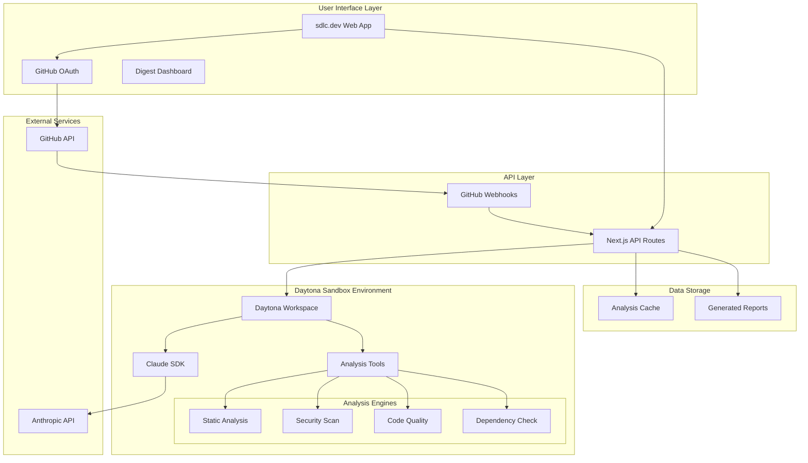
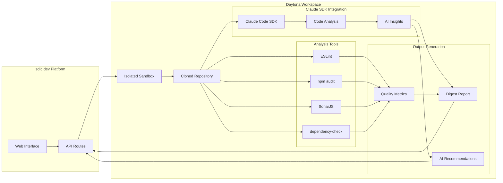
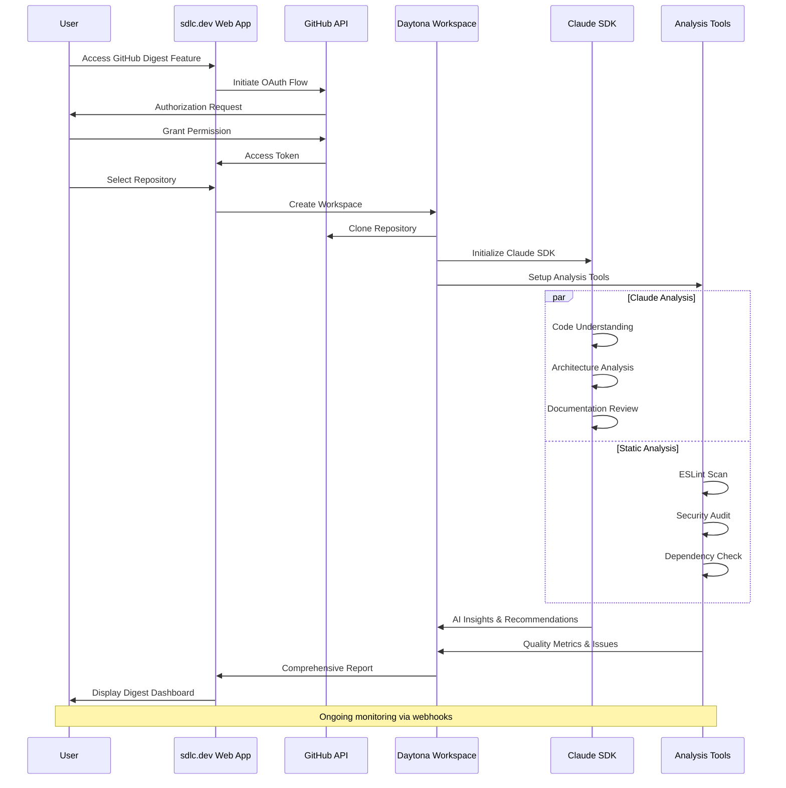

# GitHub Digest Feature - Technical Implementation Plan

## 🎯 Project Overview

**sdlc.dev** - AI-Powered Development Platform with GitHub Repository Analysis and Digest Generation

This document outlines the technical implementation plan for creating a comprehensive GitHub digest feature similar to githubdigest, leveraging Claude SDK through Daytona for repository analysis, code quality assessment, and automated reporting.

## 🏗️ Technical Architecture

### High-Level System Architecture



### Daytona Integration Architecture



## 🔄 User Flow & Process

### Complete User Journey



## 🛠️ Implementation Strategy

### Phase 1: Foundation & GitHub Integration

#### 1.1 GitHub OAuth & Repository Access
```typescript
// app/api/github/auth/route.ts
export async function GET(request: Request) {
  // GitHub OAuth implementation
  // Scope: repo, read:user, read:org
}

// app/api/github/repos/route.ts
export async function GET(request: Request) {
  // Fetch user repositories
  // Filter by permissions and activity
}
```

#### 1.2 Daytona Workspace Management
```typescript
// lib/daytona/workspace.ts
export class DaytonaWorkspace {
  async createWorkspace(repoUrl: string): Promise<string>
  async cloneRepository(workspaceId: string, repoUrl: string): Promise<void>
  async setupAnalysisEnvironment(workspaceId: string): Promise<void>
  async destroyWorkspace(workspaceId: string): Promise<void>
}
```

### Phase 2: Analysis Engine Integration

#### 2.1 Claude SDK Integration in Daytona
```typescript
// lib/analyzers/claude-analyzer.ts
export class ClaudeAnalyzer {
  constructor(private workspaceId: string) {}
  
  async analyzeCodeStructure(): Promise<ArchitectureInsights>
  async reviewDocumentation(): Promise<DocumentationReport>
  async generateOnboardingGuide(): Promise<OnboardingGuide>
  async suggestImprovements(): Promise<Recommendation[]>
}
```

#### 2.2 Static Analysis Tools Integration
```typescript
// lib/analyzers/static-analyzer.ts
export class StaticAnalyzer {
  async runESLint(workspaceId: string): Promise<ESLintReport>
  async runSecurityAudit(workspaceId: string): Promise<SecurityReport>
  async checkDependencies(workspaceId: string): Promise<DependencyReport>
  async calculateMetrics(workspaceId: string): Promise<QualityMetrics>
}
```

### Phase 3: Report Generation & UI

#### 3.1 Digest Report Generation
```typescript
// lib/digest/generator.ts
export class DigestGenerator {
  async generateReport(
    repoData: RepositoryData,
    claudeInsights: ClaudeInsights,
    staticAnalysis: StaticAnalysisResults
  ): Promise<DigestReport>
}
```

#### 3.2 Dashboard UI Components
```typescript
// components/digest/DigestDashboard.tsx
export function DigestDashboard({ report }: { report: DigestReport }) {
  // Reuse existing UI patterns from generate page
  // Clean, minimal design matching sdlc.dev theme
}
```

## 🔧 Daytona Integration Benefits

### Why Daytona for Analysis?

1. **Isolated Environment**: Each repository analysis runs in a clean, isolated workspace
2. **Scalability**: Multiple analyses can run concurrently without conflicts
3. **Security**: Repository code never touches the main application server
4. **Resource Management**: Automatic cleanup and resource optimization
5. **Tool Integration**: Easy installation and management of analysis tools
6. **Claude SDK Optimization**: Dedicated environment for AI processing

### Daytona Workspace Configuration

```yaml
# .daytona/workspace.yaml
name: repo-analysis-workspace
image: node:18-alpine

tools:
  - eslint
  - sonarjs
  - npm-audit
  - dependency-check

environment:
  ANTHROPIC_API_KEY: ${ANTHROPIC_API_KEY}
  NODE_ENV: analysis

scripts:
  setup: |
    npm install -g eslint @typescript-eslint/parser
    npm install -g sonarjs-cli
    npm install -g audit-ci
  
  analyze: |
    npm install
    eslint . --format json > eslint-report.json
    npm audit --json > audit-report.json
    sonar-scanner > sonar-report.json
```

## 📊 Analysis Capabilities

### Claude SDK Analysis Features

1. **Code Understanding**
   - Architecture pattern recognition
   - Design pattern identification
   - Code complexity analysis
   - API design review

2. **Documentation Analysis**
   - README quality assessment
   - Code comment coverage
   - API documentation completeness
   - Setup instruction clarity

3. **Best Practices Review**
   - Framework-specific recommendations
   - Security best practices
   - Performance optimization suggestions
   - Maintainability improvements

### Static Analysis Tools

1. **ESLint/TSLint**
   - Code style consistency
   - Potential bug detection
   - Best practice enforcement
   - Custom rule configuration

2. **Security Analysis**
   - Vulnerability scanning
   - Dependency security audit
   - OWASP compliance check
   - Sensitive data detection

3. **Quality Metrics**
   - Code coverage analysis
   - Cyclomatic complexity
   - Technical debt assessment
   - Maintainability index

## 📋 Digest Report Structure

### Report Sections

```typescript
interface DigestReport {
  metadata: {
    repositoryName: string
    analysisDate: Date
    overallScore: number
    lastCommit: string
  }
  
  onboarding: {
    quickStart: string[]
    prerequisites: string[]
    architecture: ArchitectureOverview
    developmentSetup: SetupInstructions
  }
  
  codeQuality: {
    score: number
    issues: Issue[]
    coverage: CoverageReport
    complexity: ComplexityMetrics
  }
  
  security: {
    vulnerabilities: Vulnerability[]
    dependencyIssues: DependencyIssue[]
    recommendations: SecurityRecommendation[]
  }
  
  insights: {
    claudeRecommendations: AIRecommendation[]
    improvementSuggestions: Suggestion[]
    nextSteps: ActionItem[]
  }
  
  activity: {
    recentCommits: Commit[]
    pullRequests: PullRequest[]
    contributors: Contributor[]
  }
}
```

## 🎨 UI/UX Design Specifications

### Design Principles
- **Consistency**: Match existing sdlc.dev clean, minimal theme
- **Clarity**: Clear information hierarchy and visual organization
- **Interactivity**: Expandable sections, drill-down capabilities
- **Accessibility**: WCAG compliant, keyboard navigation
- **Responsiveness**: Mobile-friendly responsive design

### Component Reuse Strategy
```typescript
// Reuse existing components from generate page
import { MessageDisplay } from '@/components/MessageDisplay'
import { Navbar } from '@/components/Navbar'

// New digest-specific components
import { QualityScore } from '@/components/digest/QualityScore'
import { SecurityReport } from '@/components/digest/SecurityReport'
import { OnboardingGuide } from '@/components/digest/OnboardingGuide'
```

## 🚀 Implementation Timeline

### Phase 1: Foundation (Week 1-2)
- [ ] GitHub OAuth integration
- [ ] Daytona workspace management
- [ ] Basic Claude SDK integration
- [ ] Repository cloning and setup

### Phase 2: Analysis Engine (Week 3-4)
- [ ] Claude SDK analysis implementation
- [ ] Static analysis tools integration
- [ ] Security scanning setup
- [ ] Quality metrics calculation

### Phase 3: Report Generation (Week 5-6)
- [ ] Digest report generation
- [ ] UI components development
- [ ] Dashboard implementation
- [ ] Export functionality

### Phase 4: Enhancement (Week 7-8)
- [ ] Real-time updates via webhooks
- [ ] Historical tracking
- [ ] Performance optimization
- [ ] Testing and documentation

## 🔒 Security Considerations

### Data Protection
- Repository code processed only in isolated Daytona workspaces
- No persistent storage of repository content
- Secure token management for GitHub access
- Encrypted communication between services

### Access Control
- OAuth scope limitation (read-only access)
- User permission validation
- Rate limiting for API calls
- Audit logging for security events

## 📈 Success Metrics

### Technical Metrics
- Analysis accuracy: >95%
- Processing time: <5 minutes per repository
- System uptime: >99.9%
- Error rate: <1%

### User Experience Metrics
- User engagement with digest reports
- Time to identify critical issues
- Improvement in code quality scores
- User satisfaction ratings

## 🔄 Continuous Integration

### Automated Testing
```typescript
// tests/integration/digest.test.ts
describe('GitHub Digest Integration', () => {
  test('should analyze repository and generate digest', async () => {
    // Integration test for complete flow
  })
  
  test('should handle analysis errors gracefully', async () => {
    // Error handling test
  })
})
```

### Deployment Strategy
- Staging environment for testing
- Blue-green deployment for zero downtime
- Automated rollback capabilities
- Performance monitoring and alerting

## 📚 Documentation Requirements

### Developer Documentation
- API documentation with OpenAPI specs
- Component documentation with Storybook
- Integration guides for new analysis tools
- Troubleshooting and FAQ sections

### User Documentation
- Feature overview and benefits
- Step-by-step usage guide
- Report interpretation guide
- Best practices and tips

---

## 🎯 Next Steps

1. **Review and Approve Plan**: Stakeholder review of technical approach
2. **Environment Setup**: Configure Daytona integration and development environment
3. **Phase 1 Implementation**: Begin with GitHub OAuth and basic integration
4. **Iterative Development**: Implement features in phases with continuous testing
5. **User Testing**: Beta testing with select users for feedback and improvements

This comprehensive plan ensures a robust, scalable, and user-friendly GitHub digest feature that leverages the power of Claude SDK through Daytona for superior repository analysis and insights.
